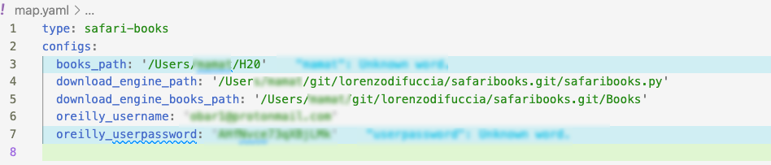
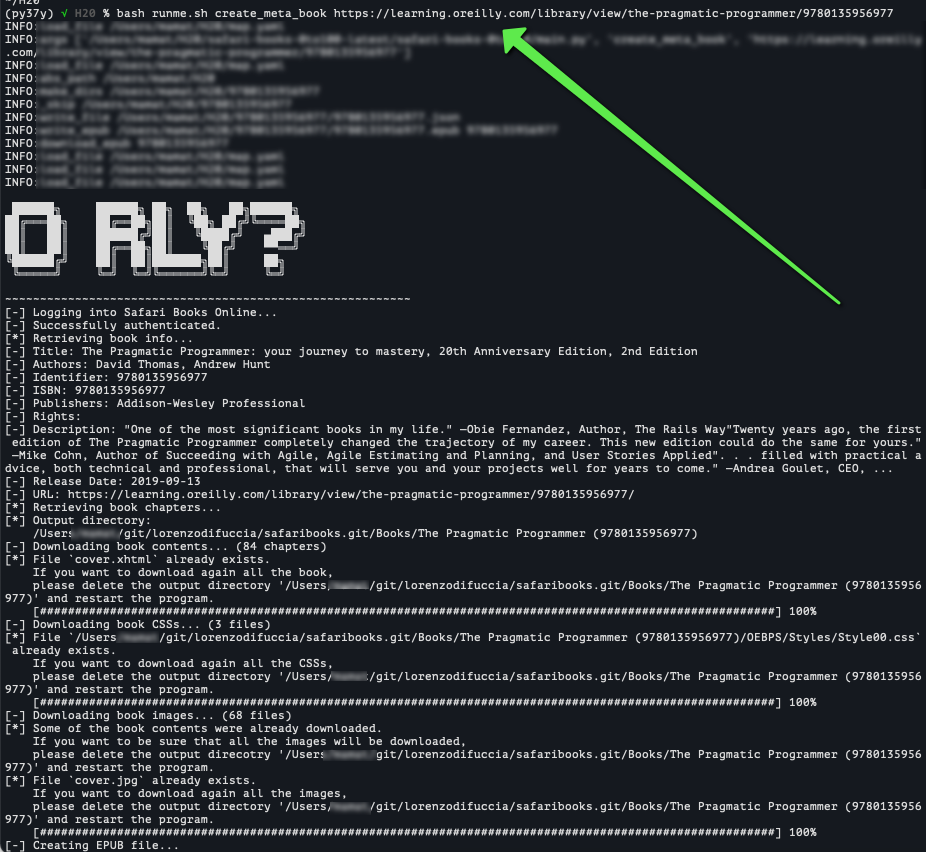
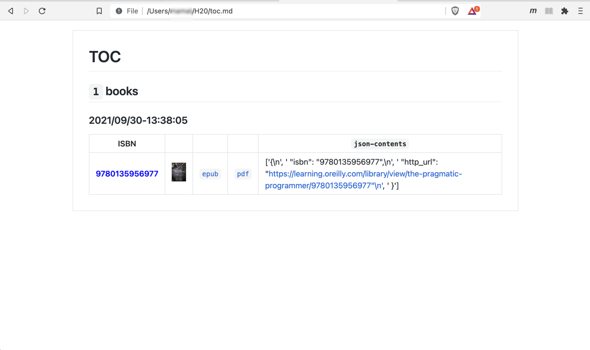
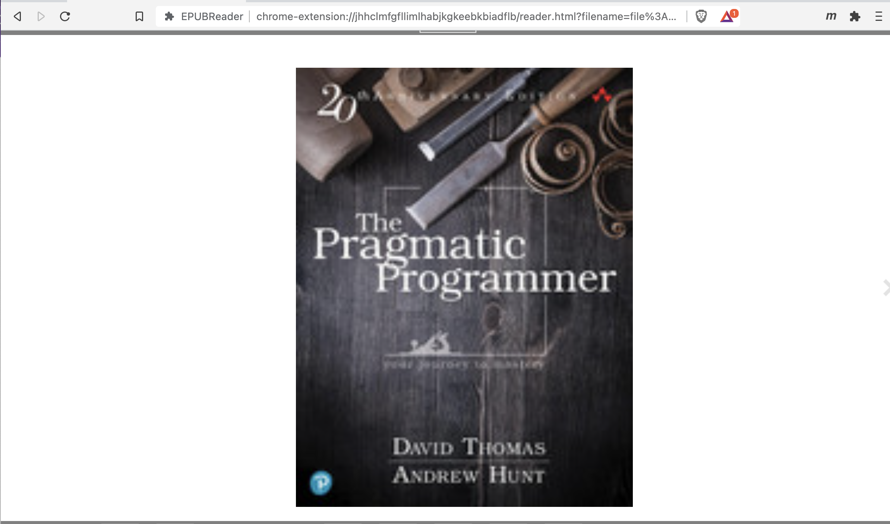

# safari books 0 to 100

simple way to keep books organized

## Installation

## Py Env
* Activate your py env
* Install Poetry: <https://python-poetry.org/docs/#installation>
* Install package and dependencies: `poetry install`

* Install https://github.com/lorenzodifuccia/safaribooks :)

## One-time Setup

check latest tag val latest at https://github.com/obar1/safari-books-0to100/tags

or https://raw.githubusercontent.com/obar1/safari-books-0to100/master/changelog.md like so

```bash
curl https://raw.githubusercontent.com/obar1/safari-books-0to100/master/changelog.md | grep version | sort -r | head -1
```

in a any tmp folder get the `setup.sh` like so

```bash
wget -q https://raw.githubusercontent.com/obar1/safari-books-0to100/master/setup.sh
```

and use it like so

```bash
# TODO: set vars
set -u
tag=
target_dir=

bash setup.sh $tag $target_dir
```
check contents of  `yaml` file for the download engine and oreilly usr/pwd

```bash
cat map.yaml
```


## Daily usage

-  create new meta_book

```bash
url=https://learning.oreilly.com/library/view/hunt-the-pragmatic-programmer/020161622X/
bash runme.sh create_meta_book $url
```


```bash
open -a "Brave Browser" toc.md
```

> using `Markdown Viewer` extension  https://chrome.google.com/webstore/detail/markdown-viewer/ckkdlimhmcjmikdlpkmbgfkaikojcbjk




> using `EPUBReder` https://www.epubread.com/en/



- help

```bash
bash runme.sh help
```

## Development

### Installation

* Install Poetry: <https://python-poetry.org/docs/#installation>
* Install python env: `pyenv install 3.7.0`
* Install virtual env: `pyenv virtualenv 3.7.0 py37`
* Activate virtual env: `pyenv activate py37`
* Install package and dependencies: `poetry install`
* Install pre-commit hooks: `poetry run pre-commit install`

### Run pre-commit hooks manually

All pre-commit hooks will be run automatically when pushing changes.
They can also be run on staged files or on all files manually:

```bash
# Run all hooks against currently staged files,
# this is what pre-commit runs by default when committing:
pre-commit run

# Run all the hooks against all the files:
pre-commit run --all-files

# Run a specific hook against all staged files:
pre-commit run black
pre-commit run flake8
pre-commit run isort
pre-commit run pylint
```
### Local troubleshooting...

add to `setup.sh` something like
```bash
# DEBUG
cp -r $HOME/git/obar1/pyproject-template.git/ "${DIR_TARGET_LATEST}" || true
```
so you can test local fix :)

### Continuous pytest

```bash
export PYTHONPATH=. && ptw -c  -- --capture=tee-sys -o log_cli=true
```
